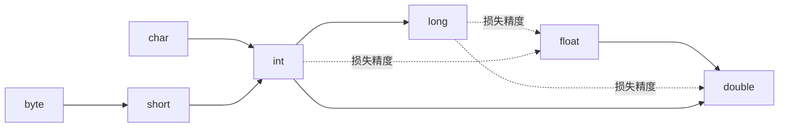

# 0 写在前面

我是按照这《Java核心技术Ⅰ》这本书第十一版来写的，摘要一些我认为比较重要的知识点，以此来巩固一下java基础知识，本人技术不是很好，如有错误，还请大家指出，谢谢大家！

# 1 Java程序设计概述
## 1.1 Java程序设计平台
java并不只是一种语言，java是一个完整的平台,它有一个庞大的库，其中包含了很多可重用的的代码，以及一个提供诸如安全性、跨操作系统以及自动垃圾收集等服务的执行环境。
## 1.2 Java关键性术语
- **简单性**
  语法简单。占用小，能够在小型机器上运行
- **面向对象**
  一种程序设计技术
- **分布式**
  可以通过URL打开和访问网络上的对象
- **健壮性**
  早期的问题检测，后期动态检测，消除容易出错的情况，让程序更加稳定
- **安全性**
  可以构建防病毒、防篡改的系统
- **体系结构中立**
  编译器生成与特定的计算机体系结构无关的字节码指令，这些编译后的代码就可以在许多处理器上运行
- **可移植性**
  除了与用户界面相关的部分，所有其他java库能很好的支持平台独立性，在写程序时不用操心底层操作系统
- **解释型**
  java9时提供的jshell支持了快捷编程，像python一样可以进行交互式编程
- **高性能**
  现在的即时编译器可以优化代码以提高速度
- **多线程**
  java是第一个支持并发程序设计的主流语言，可以提高web应用的效率
- **动态性**
  为正在运行的程序增加代码。库中可以自由添加新方法和实例变量，而对客户端没有任何的影响

## 1.3 Java applet 与 Internet
早期为了实现浏览器中的动态页面效果，用户从互联网上下载Java字节码，并在自己的电脑上运行。在网页中运行的Java程序成为applet。只需要启用一个Java的Web浏览器，它就会为你执行字节码文件，不需要安装任何软件。
++现在已经不用这项技术了,由于浏览器的不支持以及各种限制++

## 1.4 Java发展史
- 1991 Patrick Naughton与James Gosling带领的Sun公司设计一钟小型的计算机语言，以运用于像有限电视转换盒这类消费设备，开始起名为Oak，但由于这个名字已被注册，故改为Java。
- 1996 Sun发布了第一个版本Java 1.0
- 1998 Sun发布了Java 1.1
- 2000 Sun发布了Java 1.3
- 2002 Sun发布了Java 1.4
- 2004 Sun发布了Java 5.0
- 2006 Sun发布了Java 6(没有后缀.0)
- 2009 Oracle收购了Sun
- 2011 Oralce发布了Java 7
- 2014 Oracle发布了Java 8 ++“函数式”编程方式在这个版本，可以很容易表述并发执行的计算++
- 2017 Oracle发布了Java 9
- 从2018年开始，每六个月就会有一个新版本,以支持更快地引入新特性

| Java版本 |                                 新语言特性                                 | 类和接口的数量 |
|:----:|:--------------------------------------------------------------------------:|:--------------:|
| 1.0  |                                  语言本身                                  |      211       |
| 1.1  |                                   内部类                                   |      477       |
| 1.2  |                               strictfp修饰符                               |      1524      |
| 1.3  |                                     无                                     |      1840      |
| 1.4  |                                    断言                                    |      2723      |
| 5.0  | 泛型类、“for each”循环、可变元参数、自动装箱、元数据、效率、枚举、静态导入 |      3279      |
|  6   |                                     无                                     |      3796      |
|  7   |        基于字符串的选择语句、菱形运算符、二进制字面量、异常处理增强        |      4024      |
|  8   |             lambad表达式、包含默认方法的接口、流和日期/时间库              |      4240      |
|  9   |                         模块、其他的语言和类库增强                         | 6005               |

# 2 Java程序设计环境
## 2.1 安装Java开发工具包
- 下载Java开发工具包 [www.oracle.com/technetwork/java/javase/dawnloads](www.oracle.com/technetwork/java/javase/dawnloads)
- Java术语

术语名|缩写|解释|
| :-------: | :-------------: | :-------:|
| Java Development Kit(Java开发工具包)     | JDK       | 编写Java程序的程序员用的软件                                               |
| Java Runtime Environment(Java运行时环境) | JRE       | 运行Java程序的用户使用的软件                                               |
| Server JRE(服务器JRE)                    | -         | 在服务器上运行Java程序的软件                                               |
| Standard Edition                         | SE        | 用于桌面或简单服务器应用的平台                                             |
| Enterprise Edition                       | EE        | 用于复杂服务器应用的Java平台                                               |
| Micro Edition                            | ME        | 用于小型设备的Java平台                                                     |
| Java FX                                  | -         | 用于图形化用户界面的一个备选工具包，在Java 11前的某些Java SE发布版本中提供 |
| Java 2                                   | J2        | ++一个过时的术语++，用于描述1998~2006年之间的Java版本                      |
| Software Development Kit(软件开发工具包) | SDK       | ++一个过时的术语++,用于描述1998~2006年之间的JDK                            |
| Update                                   | u         | Oracle公司的术语，表示Java 8 之前的bug修正版本                             |
| NetBeans                                 | -         | Oracle公司的集成开发环境                                                                           |
- Java概念图的描述
  
  [来源于Oracle官网](https://docs.oracle.com/javase/8/docs/)
## 2.2 使用命令行编译运行Java程序
```shell
javac xxx.java #编译
java xxx	#运行
```
## 2.3 使用集成开发环境
Eclipse或者IntelliJ IDEA(推荐)
## 2.4 使用JShell
交互式的编程，在Java 9以后出现的技术
# 3 Java的基本程序设计结构
## 3.1 一个简单的Java应用程序
```java
public class FirstExample{
    public static void main(String[] args){
    	System.out.println("We will not use 'Hello World!'"); 
   }
}
```
- 程序中的内容都包含在类(class)中
- 区分大小写
- 要运行必须有一个主方法main,必须是如上这种形式
- public表示其他部分对此程序的访问级别
- void表示方法没有返回值
- static表示此方法是静态的
- 'String[] args'表示接收一个String类型数组的参数args，args可以改成其他合法变量名。可以这样进行传参java FirstExample param1 param2 param3 ...
- System是java.lang包下的一个类。out是System类的一个属性，类型是PrintStream类,而PrintSteam类又有一个方法out(),因此这样调用这个方法
- 控制台输出 ++We will not use 'Hello World!'++
## 3.2 注释
```java
/*
多行注释
*/
public class FirstExample{
    public static void main(String[] args){
    //单行注释
    	System.out.println("We will not use 'Hello World!'"); 
   }
}
```
## 3.3 数据类型
> Java是强类型语言，每个变量声名你都要指定他的类型
> 在Java中共有8中基本类型，其中++4种++为整型,++2种++为浮点型，++1种++为字符类型，++1种++为布尔类型
### 3.3.1 整型
| 类型  | 存储需求 |          取值范围          |
|:-----:|:--------:|:--------------------------:|
| byte  |  1字节   |          -128~127          |
| short |  2字节   |       -3 2768~3 2767       |
|  int  |  4字节   | -21 4748 3648~21 4748 3647 | 
| long  |  8字节   | -922 3372 0368 5477 5808~922 3372 0368 5477 5807                          |

> 长整型有一个后缀l或者是L(如4000000000L)
> Java 7开始加上前缀0b/0B可以写二进制数，字面量可以加下划线，方便读,比如1000_0000
- Java没有无符号形式的int,short,long或者Byte，假如你想表示0~255的范围，参考以下代码
```java
public class TEST {
    public static void main(String[] args) {
        byte b1 = 1;
        byte b2 = -5;
        int unsignedByte = Byte.toUnsignedInt(b1);
        int unsignedByte2 = Byte.toUnsignedInt(b2);
        System.out.println("unsignedByte = " + unsignedByte);//unsignedByte = 1
        System.out.println("unsignedByte2 = " + unsignedByte2);//unsignedByte2 = 251
    }
}
```


### 3.3.2 浮点类型

|  类型  | 存储需求 |                 取值范围                  |
|:------:|:--------:|:-----------------------------------------:|
| float  |  4字节   | 大约 +-3.402 823 47E+38F(有效位数为6~7位) |
| double |  8字节   | 大约 +-1.797 693 134 862 315 70E+308(有效位数位15位)                                          |
> float类型后面有个后缀F或者f,没有后缀的浮点数默认为double类型

**所有的浮点数数值计算都遵循IEEE 754规范,后面的值对应Java种的表示**
1. 正无穷大  Double.POSITIVE_INFINITY
2. 负无穷大  Double.NEGATIVE_INFINITY
3. NaN（不是一个数字）Double.NaN

++一个正整数除以0的结果为正无穷大。计算0/0或者负数的平方根结果为NaN++
++不能检测一个值是否等于NaN，要使用Double提供的方法++
```java
public class TEST {
    public static void main(String[] args) {
        double sqrt = Math.sqrt(-1);
        System.out.println(sqrt == Double.NaN); // false
        System.out.println(Double.isNaN(sqrt)); // true
    }
}
```
二进制无法精确的表示一些数字，比如1/10，对应金融方面的计算，请使用BigDecimal类
```java
import java.math.BigDecimal;

public class TEST {
    public static void main(String[] args) {
        System.out.println(2-1.1);// 0.8999999999999999

        BigDecimal num1 = new BigDecimal("2");
        BigDecimal num2 = new BigDecimal("1.1");
        System.out.println(num1.subtract(num2)); // 0.9

        //有些浮点数不能被精确的表示为一个double类型的值，所以要传入字符串
        //如果传入的是浮点数，那么用BigDecimal也会出错
        num1 = new BigDecimal(2);
        num2 = new BigDecimal(1.1);
        System.out.println(num1.subtract(num2)); // 0.899999999999999911182158029987476766109466552734375
    }
}

```
### 3.3.3 字符类型
char类型占用2个字节，其原本用于表示单个字符，例如'a'、'1'。如今，有些Unicode字符可以用一个char值描述，但有些需要两个char值。char类型的数值可以表示为十六进制值,++从\u0000到\uFFFF++。
>特殊字符的转义序列

| 转义序列 |  名称  | Unicode值 |
|:--------:|:------:|:---------:|
|    \b    |  退格  |  \u0008   |
|    \t    |  制表  |  \u0009   |
|    \n    |  换行  |  \u000a   |
|    \r    |  回车  |  \u000d   |
|   \\"    | 双引号 |  \u0022   |
|   \\'    | 单引号 |  \u0027   |
|   \\\    | 反斜杠 |  \u005c   | 

++:exclamation:警告：Unicode转义序列会在解析代码之前得到处理，观察以下代码++
```java
public class TEST {
    public static void main(String[]args) {
        System.out.println("\u0022+\u0022"); // "" (空串)
        // \u000A  是新的一行 报错:java: 需要';'
        // \usera java: 报错:非法的 Unicode 转义
    }
}
```
### 3.3.4 Unicode和char类型
Unicode是java中使用的字符集，相当于一本字典。开始时Java使用16位(2个字节)的字符集,当时Unicode字典不是很大，2个字节完全能容纳所有字符，但随着中文，日文等其他字符加入，就显得不够用了，2个字节无法完全表示所有字符。因此，从Java 5开始，有些字符需要4个字节来表示，即2个char类型的值，下面来讲一下如何用两个char类型的值表示我们现在世界上所有的字符。

**先介绍以下术语：**
- 码点
  一个编码表中的某个字符对应的代码值(Unicode标准中，码点采用以‘U+’为前缀，后面是十六进制的值。如U+1D546代表字符𝕆)
- 平面
  在上面的介绍中，提到了 Unicode 是一本很厚的字典，她将全世界所有的字符定义在一个集合里。这么多的字符不是一次性定义的，而是分区定义。每个区可以存放 65536 个$2^{16}$字符，称为一个平面（plane）。目前，一共有 17 个（$2^4+1$）平面，也就是说，整个 Unicode 字符集的大小现在是 $2^{21}$

Unicode的码点划分为17个代码平面(code plane)。第一个称为基本多语言平面(basic multilingual plane),他包含码点从U+0000到U+FFFF的“经典”Unicode代码；其余的16个平面码点从U+010000到U+10FFFF，包括辅助字符(supplementary character)，这些平面叫++辅助平面++。

UTF-16编码采用不同长度的编码表示所有Unicode代码。在基本多语言平面中，++每个字符用16位表示(2个字节，也就是char类型能正常表达的值)++,通常称为代码单元(code unit)。这里有一个很巧妙的地方，在基本平面内，从 U+D800 到 U+DFFF 是一个空段，即这些码点不对应任何字符。因此，这个空段可以用来映射辅助平面的字符。

辅助平面的字符位共有$2^{20}$ 个，因此表示这些字符至少需要 20 个二进制位。UTF-16 将这 20 个二进制位分成两半，前 10 位映射在 U+D800 到 U+DBFF，称为高位（H），后 10 位映射在 U+DC00 到 U+DFFF，称为低位（L）。这意味着，一个辅助平面的字符，被拆成两个基本平面的字符表示。

因此，当我们遇到两个字节，发现它的码点在 U+D800 到 U+DBFF 之间，就可以断定，紧跟在后面的两个字节的码点，应该在 U+DC00 到 U+DFFF 之间，这四个字节必须放在一起解读。

**接下来，以符号"𝕆"为例，说明 UTF-16 编码方式是如何工作的。**
"𝕆"的码点为++U+1D546++，该码点显然超出了基本平面的范围 ++(0x0000 - 0xFFFF)++，因此需要使用四个字节表示。首先用 ++0x1D546 - 0x10000++ 计算出超出的部分，然后将其用 20 个二进制位表示（不足前面补 0 ），结果为++0000110101 0101000110++。接着，将前 10 位映射到 U+D800 到 U+DBFF 之间，后 10 位映射到 U+DC00 到 U+DFFF 即可。U+D800 对应的二进制数为 1101100000000000，直接填充后面的 10 个二进制位即可，得到 ++1101100000110101++，转成 16 进制数则为 ++0xD835++。同理可得，低位为 ++0xDD46++。因此得出"𝕆"的 UTF-16 编码为 ++0xD835 0xDD46++。
[这里参考了别人的文章](https://blog.csdn.net/hezh1994/article/details/78899683)
> 代码示例
```java
public class TEST {
    public static void main(String[]args) {
        // 𝕆的码点是U+1D546
        long c = 0x1d546;
        long H = (long) (Math.floor((c-0x10000) / 0x400)+0xD800);
        long L = (c - 0x10000) % 0x400 + 0xDC00;
        System.out.println("得到两个代码单元:"+Long.toHexString(H)+"  "+Long.toHexString(L));//得到两个代码单元:d835  dd46
        System.out.println("打印字符：\ud835\udd46");//𝕆
    }
}
``` 
### 3.3.5 boolean类型
占1个字节。只有两个值false和true，用来进行逻辑判断。++:exclamation:整型值和boolean不能互转++

## 3.4 变量与常量
```java
//声明变量
//变量名由大小写字母，数字，下划线，$组成，但不能以数字开头。
double salary; 
int code;
boolean flag;
int i,j;
byte _t;
short $ ;
//变量赋值
code = 1;
int a=1,b=2;
//java 10 开始，对于局部变量，可以使用var关键字声明变量,它可以自行推断出它的类型
var i = 12;// int
var greeting = "hello"; //String

//常量
public class TEST {
    public static void main(String[] args) {
        System.out.println(A.CONSTANT); // 4
        final double PIN = 3.14;
        PIN = 1; // error : cannot assign a value to final variable
    }
}

class A{
    public static final int CONSTANT = 4;
}

//枚举
public class TEST {
    public static void main(String[] args) {
        Size a = Size.SMALL;
        System.out.println(a.getMsg()); // s
    }
}

enum Size{
    SMALL("s"),MEDIUM("m"),LARGE("l"),EXTRA_LARGE("x");

    private String msg;

    Size(String msg) {
        this.msg = msg;
    }

    public String getMsg() {
        return msg;
    }

    public void setMsg(String msg) {
        this.msg = msg;
    }
}
```
++:exclamation:java保留字不能作为变量名。Java9中单下划线_不能作为变量名。++
## 3.5 运算符
### 3.5.1 算术运算符
\+ - * / % 加减乘除取模

 ```java
 public class TEST {
    public static void main(String[] args) {
        System.out.println(1+2);//3
        System.out.println(3/2.0);//1.5
        System.out.println(3/2);//1
        System.out.println(4*9);//36
        System.out.println(5-21.4);//-16.4
        System.out.println(27%5);//2
    }
}
 ```
>  如double res = x\*y/z;这个计算表达式，虽然java的double是8字节，用64位存储一个数字，
>  但是有些处理器使用的是80位浮点寄存器，这样的话就会先计算x*y的结果，然后存入++80位
>  寄存器++，再除以z，将结果截断成64位的，这样的话他的结果就会比较准确，但是这也违背了
>  java的++可移植性++。如何解决？在main方法上添加关键字strictfp,即可让main方法中的浮点
>  计算都使用64位来进行存储。
>    public static strictfp void main(String[] args) {}
### 3.5.2 内置类Math
Math类包含了各种各样的数学函数
```java
public class TEST {
    public static strictfp void main(String[] args) {
        System.out.println(Math.sqrt(4));//开根号:2
        System.out.println(Math.PI);//PI的值：3.141592653589793
    }
}
```
[更多请参考API文档(java8)](https://docs.oracle.com/javase/8/docs/api/)

### 3.5.3 数值类型的转换



```java
public class TEST {
    public static strictfp void main(String[] args) {
        int a = 123456789;
        float a1 = a;
        double a2 = a;
        System.out.println(a);//123456789
        System.out.println(a1);//1.23456792E8
        System.out.println(a2);//1.23456789E8
    }
}
```
损失精度的转换进行强制转换
```java
public class TEST {
    public static strictfp void main(String[] args) {
        int a = 128;
        byte a1 = (byte) a;
        short a2 = (short) a;
        System.out.println(a);//128
        System.out.println(a1);//-128
        System.out.println(a2);//128
    }
}
```
### 3.5.4 其他运算符
```java
//二元运算符
x += 4;//x = x+4
x -= 3.5;//x = (int)(x-3.5)

//自增自减
a = x++;//先赋值给a再自加1
b = --x;//先自减1再赋值给b

//关系与boolean表达式
3 == 7 //返回false
3 != 4 //返回true
7 == 7 & 3 !=7 //返回true
7 == 7 || 3 !=7 //返回true。短路或，当第一个值为真时不去判断第二个表达式
condition ? expersion1 : expersion2 // 当condition = true时返回第一个值，否则返回第二个值
```
位运算符:

- &("and")	|("or")		^("xor")	~("not")
- <<左移 >>右移  >>>右移(高位补0,'>>'是用符号位填充高位)

```java
public class TEST {
    public static strictfp void main(String[] args) {
        byte a = 0b0000_0001 & 0b0000_0011;
        System.out.println(Integer.toBinaryString(a));//1 也就是0000 0001
        System.out.println(a);//1

        a = 0b0000_0001 | 0b0000_0011;
        System.out.println(Integer.toBinaryString(a));//11 0000 0011
        System.out.println(a);//3

        a = 0b0000_0001 ^ 0b0000_0011;
        System.out.println(Integer.toBinaryString(a));//10 0000 0010
        System.out.println(a);//2

        a = ~0b0000_0001;
        System.out.println(Integer.toBinaryString(a));//1111 1110
        System.out.println(a);//-2

        System.out.println(2 >> 1);//1
        System.out.println(2 >> 2);//0
        System.out.println(2 >> 3);//0
        System.out.println(-1 >> 1);//-1
        
        System.out.println(-1 >>> 1);//2147483647
        /*解释：
        	-1的二进制表示：1111 1111 1111 1111 1111 1111 1111 1111
           右移一位:
           >>高位添加符号位:还是以上值 故 -1 >> 1 还是 -1
           >>>高位添加0:0111 1111 1111 1111 1111 1111 1111 1111 所以是int的最大正值
        */
        
        System.out.println(1 << 1);//2
        System.out.println(1 << 3);//8
    }
}


```

# 4 类和对象